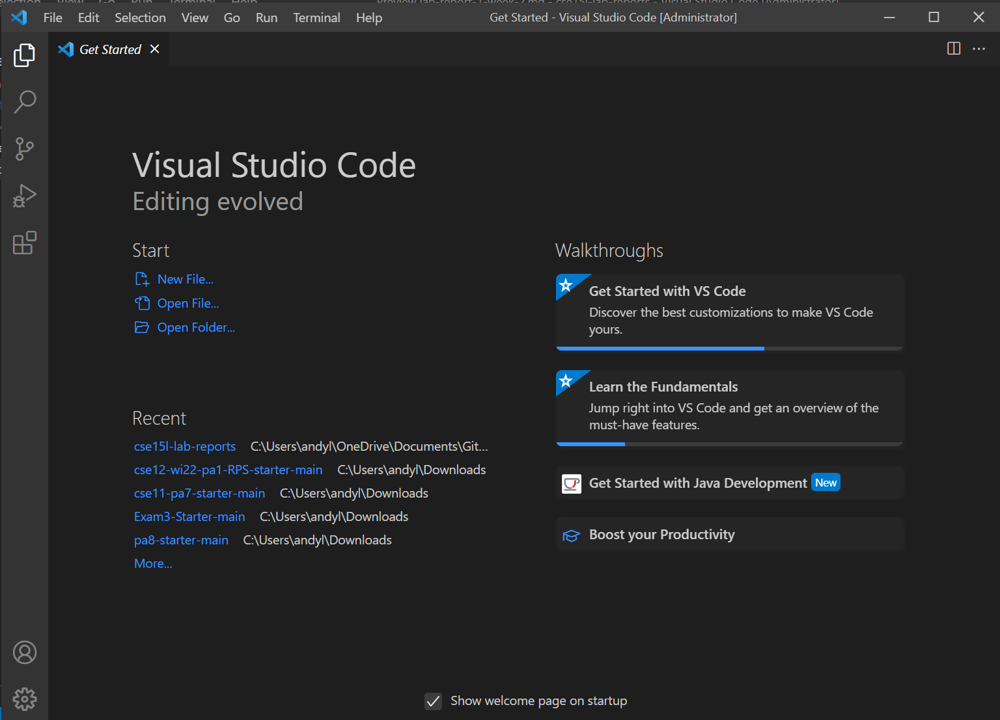
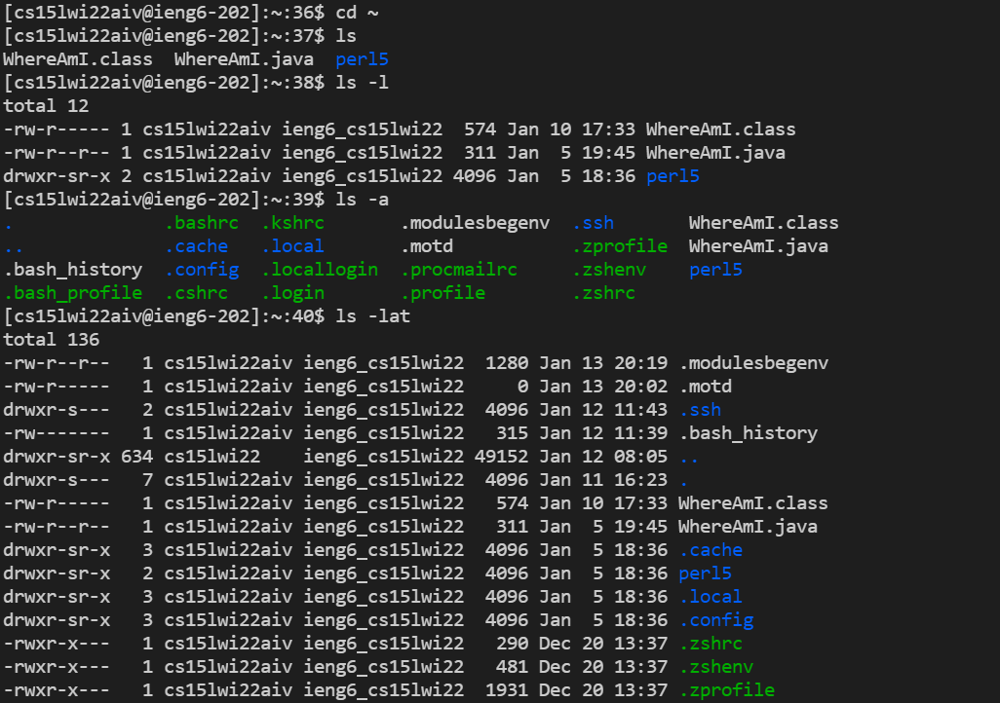
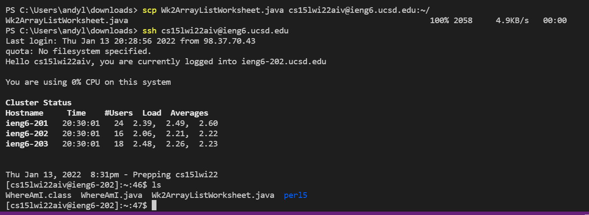
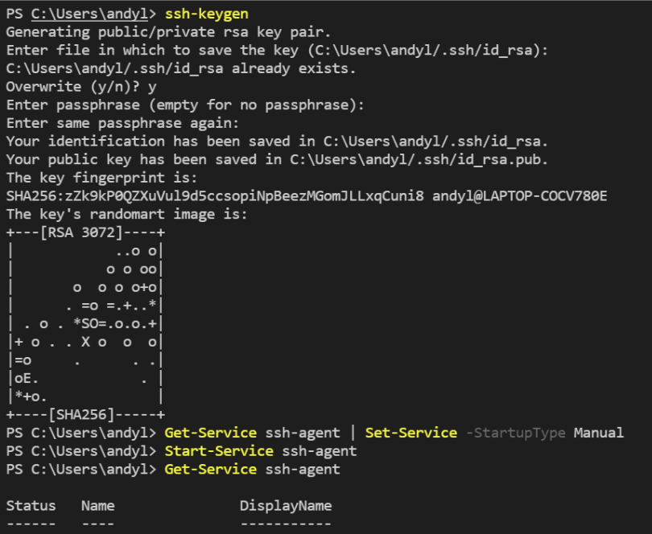
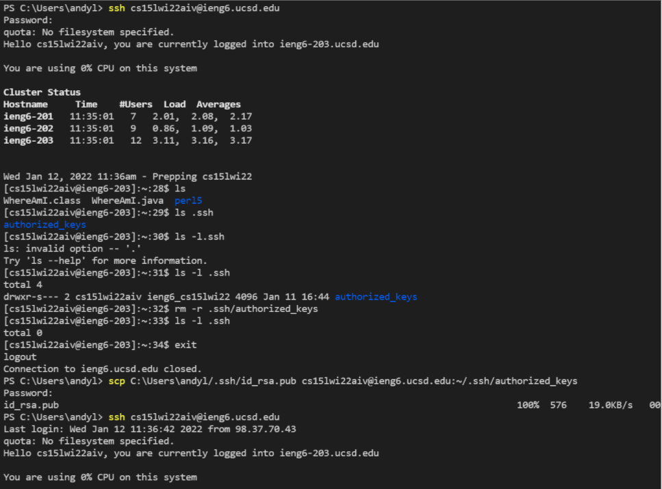
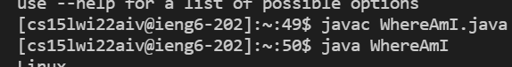
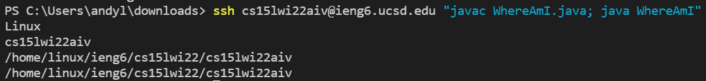

# LAB REPORT 1 Week 2
Andy Liu, A17112518

First off, I downloaded the IDE Visual Studio Code(abbreivated as vsc) from https://code.visualstudio.com/Download. I then opened up the terminal to type commands with by clicking on the Terminal button at the top. 

To log into the remote ieng6 servers, you need to typed in the command 'ssh cs15lwi22aiv@ieng6.ucsd.edu'. Next, I entered my password, which is not visible for security reasons.

This is what shows up once you are logged in.

Here are some commands that I tried out on my computer. "cd" brings me to the home directory, while "ls" gives me a list of the visible files in that directory. "ls -a" and "ls -l" shows me all the hidden files and longer details about them.

I copied a local file from my computer to the ieng6 server using "scp Wk2ArrayListWorksheet.java cs15lwi22aiv@ieng6.ucsd.edu:~/". It is important to include the ":~/" after edu so it adds it to the home directory. I had a hard time finding the file when I didn't do that.

On my local terminal, I used the command ssh-keygen to create an ssh key on my own computer. I had to go through extra steps in order to make the key active because I am on Windows. I then had used scp C:\Users\andyl/.ssh/id_rsa.pub cs15lwi22aiv@ieng6.ucsd.edu:~/.ssh/authorized_keys to copy the key over to my account on the server.

To optimize copying files to from my computer to the server, I can combine multiple commands into one line. Before, I had 3 different commands: one to log in, one javac command, and one java command. Now, I can do it all in one line while logging in by using ssh cs15lwi22aiv@ieng6.ucsd.edu "javac WhereAmI.java; java WhereAmI"

