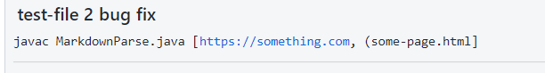

# LAB REPORT 2 Week 4
Andy Liu, A17112518

## Bug Fix 1

[test-file1](test-file1.md)

Removing the parentheses at the end of the file caused the code to run in a forever loop.
The condition was for index to be greater than length of markdown, so the entire file gets parsed. However, it can't reach the end if the last parentheses is not there.

## Bug Fix 2

[test-file2](test-file2.md)

When the input(link) had extra parentheses, the parentheses were returned too. This should not happen, since links cannot contain parentheses.

## Bug Fix 3

[test-file3](test-file3.md)

What is inside the parentheses might not really be a link, but it gets added to the list anyway. To check to see if it is a link, the string that would get returned has to contain a "."