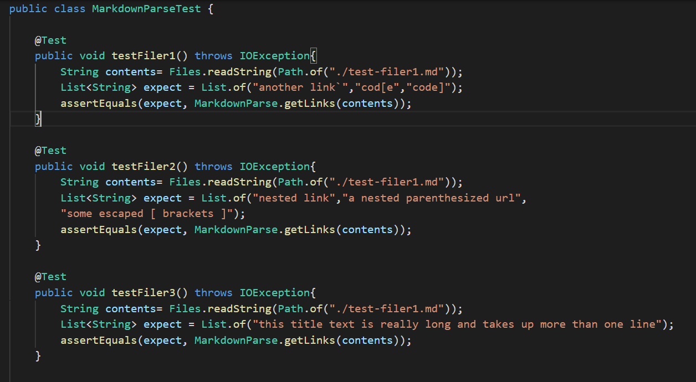
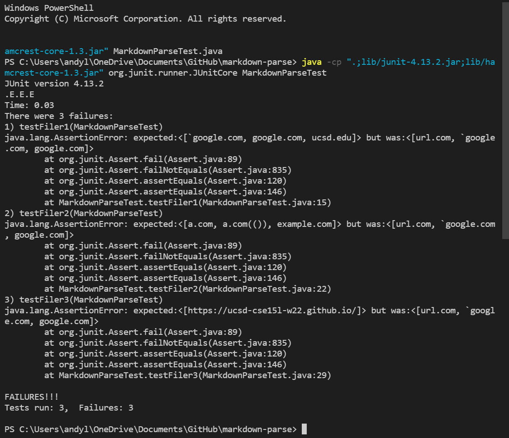
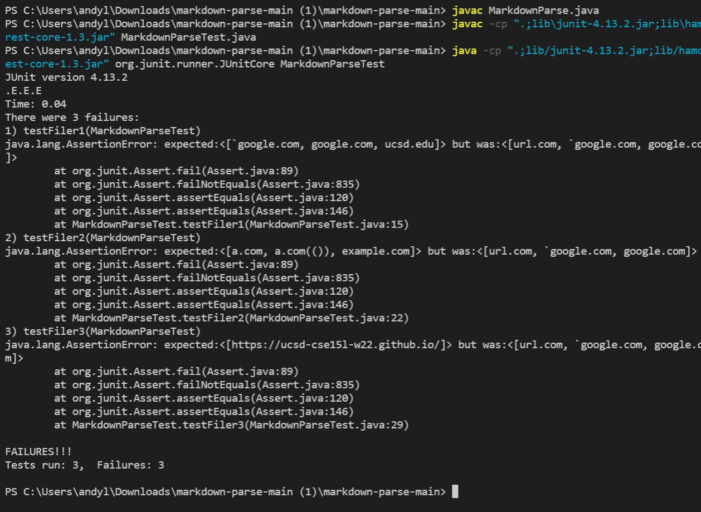

# LAB REPORT 4 Week 8
Andy Liu, A17112518

## MarkdownParse Repositories:

[My MD Repository](https://github.com/Andy8131/markdown-parse)

[Reviewed Repository](https://github.com/mBookUCSD/markdown-parse)

These are the test-files tested for both repositories(same name in both).

test-filer1:
```md
`[a link`](url.com)

[another link](`google.com)`

[`cod[e`](google.com)

[`code]`](ucsd.edu)
```

test-filer2:

```md
[a [nested link](a.com)](b.com)

[a nested parenthesized url](a.com(()))

[some escaped \[ brackets \]](example.com)
```

test-filer3:

```md
[this title text is really long and takes up more than 
one line

and has some line breaks](
    https://www.twitter.com
)

[this title text is really long and takes up more than 
one line](
    https://ucsd-cse15l-w22.github.io/
)


[this link doesn't have a closing parenthesis](github.com

And there's still some more text after that.

[this link doesn't have a closing parenthesis for a while](https://cse.ucsd.edu/


)

And then there's more text
```

## Expected Results of Method Call

Calling MarkdownParse.getLinks(test-filer1) should return the string: ["another link`","cod[e","code]]


Calling MarkdownParse.getLinks(test-filer2) should return the list: ["nested link","a nested parenthesized url",
        "some escaped [ brackets ]]


Calling MarkdownParse.getLinks(test-filer3) should return the string:

["this title text is really long and takes up more than one line"]


## These are the tests for both files:



## Running the TestFiles:

Using my repository this is the result:



Using the reviewed repository, this is the result:

