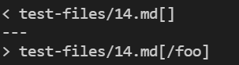
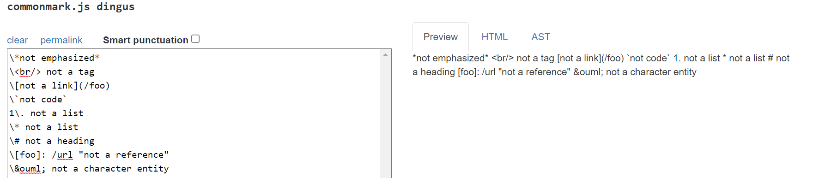
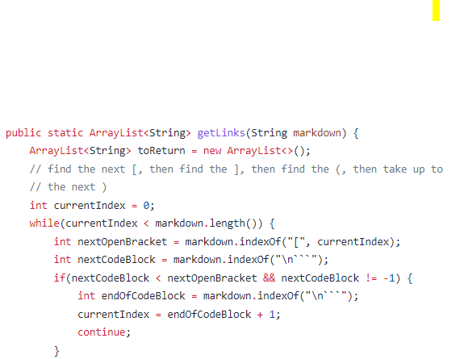
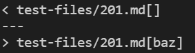
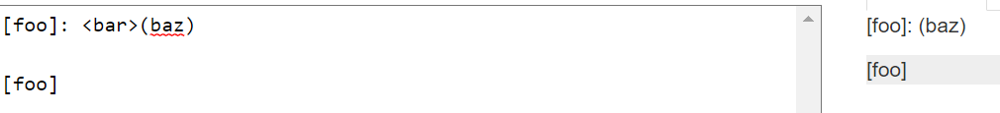

# LAB REPORT 5 Week 10
Andy Liu, A17112518

## How the different tests were found:


I used the command:


```
diff ~/myrepo/markdown-parse/results.txt ~/lab9/markdown-parse/results.txt

```

to get the different test file results. The results from my own MarkdownParse was in the directory myrepo, while the results from the provided MarkdownParse was in the directory lab9.

## Test Case 14:


My markdown parse implementation is right, while the provided implementation is wrong. There should be no link. Here is what common mark reads and shows:




The issue with the given implmentation is that it does not look for the cases where special characters can alter the meaning of a piece of code. For example "\" can exit a command. 



In the code above, there is no check to see if a "\" comes before a an open bracket, but it does check for backticks.

A potential fix would be to check if there is a "\" coming right before an open bracket.


## Test Case 14:



My markdown parse implementation is correct, while the provided implementation is not. There should not be a link. Here is what is should look like: 



The issue with Joe's code is that it does not account for words that come in between the nextCloseBracket and openParen.


A potential fix is to have a check, using substring, to see if the distance between openParen and nextCloseBracket is -1. This can be done after trimming the space between them, since just having spaces can still be a valid link.